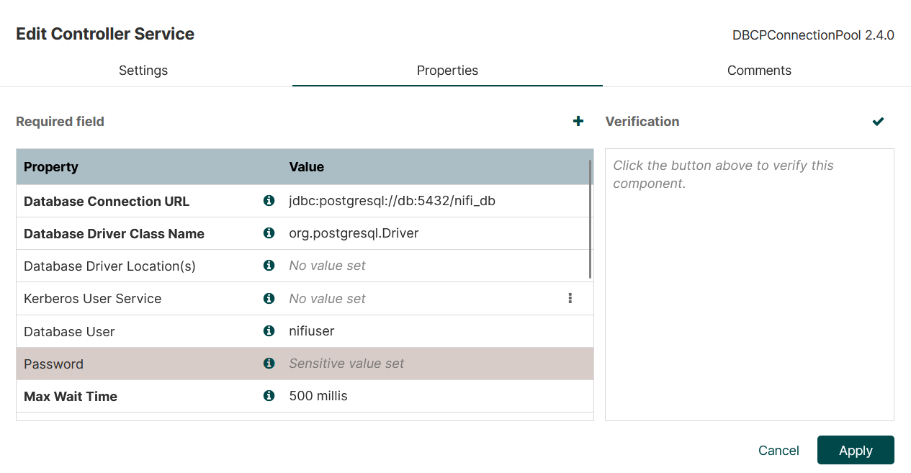

# Setup

- docker build -t my-nifi:custom .
- docker-compose up -d
- Go to https://localhost:8443/nifi/ and login to your NiFi instance (user + pw in docker-compose)
- You are ready to start building your first dataflow
- To connect to Postgres setup this DBCPConnectionPool Controller Service (password inside of docker-compose):

